# 🛰️ Telegram Sentry: Real-Time Air Threat Visualizer

```
      📡
     / \
    | ● |
   /-----\
  /_______\
```

**Telegram Sentry** is an automated system that monitors a specified Telegram channel for real-time air threat intelligence. It uses a Large Language Model (LLM) to parse unstructured, natural-language reports, maintains a persistent state of all active threats in a local database, and generates dynamic 3D map visualizations of the unfolding situation.

[](https://nodejs.org/)
[](https://opensource.org/licenses/MIT)
[](https://playwright.dev/)
[](https://github.com/gram-js/gramjs)
[](https://www.maptiler.com/)
[](https://www.sqlite.org/index.html)

---

## 📸 Demo

The system listens to a source channel and, upon detecting a new threat report, posts a two-part update to a destination channel:

1.  A forwarded copy of the original intelligence message.
2.  A reply to that message containing a dynamically generated map screenshot, visualizing the current state of all active threats.


## ✨ Core Features

- **🤖 Real-Time Monitoring**: Uses the Telegram Client API (`gram.js`) to listen for new messages in a channel instantly.
- **🧠 AI-Powered Parsing**: Leverages a powerful LLM to understand complex, evolving, and often informal Ukrainian-language reports. It extracts key data like item type, quantity, origin, and destination.
- **🧭 Directional Intelligence**: The LLM can interpret vague directions (e.g., "moving west", "towards Kyiv") and the map generator will dynamically plot these vectors.
- **💾 Persistent State Management**: Tracks all active airborne objects (drones, rockets) across multiple messages using an **SQLite** database. The state survives application restarts.
- **⏰ Intelligent Timeout**: If no new reports are received within a configurable period (default: 1 hour), the system automatically assumes all threats have landed, clears the state, and posts an "all clear" message.
- **🗺️ Dynamic 3D Map Generation**: Uses Playwright and MapLibre GL to generate high-quality, 3D perspective maps. It features a smart bounding box to perfectly frame the action.
- **🔧 Configurable & Modular**: Easily configured via a `.env` file. The code is split into logical modules for state, AI, mapping, database, and core logic.

## ⚙️ How It Works: Message Workflow

The system follows a clear, event-driven workflow for each new message.

```mermaid
graph TD
    A[📡 Source Channel] -->|New Message| B{🤖 main.js};
    B -->|Message Text & Context| C[🧠 llm-processor.js];
    C -->|Fetch API| D(☁️ OpenRouter LLM);
    D -->|Structured JSON Events| C;
    C -->|Returns Events Array| B;
    B -->|Log Message & Events| E[(🗄️ SQLite Database)];
    B -->|Process Events| F[🚦 state-manager.js];
    F -->|Updates/Reads State| E;
    F -->|Current World State| G[🗺️ map-generator.js];
    G -->|Geocode Locations| H(🌐 MapTiler API);
    G -->|Render 3D Map| I(🎭 Playwright Headless Browser);
    I -->|Screenshot Saved| G;
    G -->|Returns Map Path| B;
    B -->|Forward Original & Reply with Map| J[✍️ Destination Channel];
```



## 🏗️ System Architecture

The project is broken down into interconnected modules, each with a specific responsibility. `main.js` acts as the central orchestrator.

```mermaid
graph LR
    subgraph Core Logic
        Main[🤖 main.js]
    end

    subgraph Modules
        LLM[🧠 llm-processor.js]
        State[🚦 state-manager.js]
        MapGen[🗺️ map-generator.js]
        DB[🗄️ database.js]
        Config[⚙️ config.js]
    end

    subgraph External Services
        Telegram[(📱 Telegram API)]
        OpenRouter[(☁️ OpenRouter)]
        MapTiler[(🌐 MapTiler API)]
    end

    Main --> Config
    Main --> LLM
    Main --> State
    Main --> MapGen
    Main -- Interacts with --> Telegram

    LLM --> OpenRouter
    LLM --> Config

    State --> DB
    State --> Config

    MapGen --> DB
    MapGen --> Config
    MapGen --> MapTiler
```



## ✅ Prerequisites

- [Node.js](https://nodejs.org/) (v22.x or higher recommended)
- A Telegram account with API credentials.
- API keys for [OpenRouter.ai](https://openrouter.ai/) (or another OpenAI-compatible service) and [MapTiler](https://www.maptiler.com/cloud/).

## 🚀 Installation & Setup

**1. Clone the Repository**

```bash
git clone <your-repository-url>
cd telegram-sentry
```

**2. Install Dependencies**

```bash
npm install
```

This also downloads the Playwright browser binaries needed for map generation.

**3. Project Structure**

Ensure your project has the following structure. The `public/assets` directory is crucial for serving the 3D models to the map generator. The `history` directory will be created automatically.

```
/telegram-sentry
├── .env
├── main.js
├── state-manager.js
├── llm-processor.js
├── map-generator.js
├── database.js
├── config.js
├── template.html
├── package.json
├── public/
│   └── assets/
│       ├── shahed.gltf
│       └── rocket.gltf
└── history/
    ├── db/
    │   └── sentry.sqlite
    └── screenshots/
        └── map_123.png
```

**4. Obtain API Credentials**

- **Telegram API**:

  - Log in to [my.telegram.org](https://my.telegram.org).
  - Go to "API development tools" and create a new application.
  - You will get an `API_ID` and `API_HASH`.
  - The `TELEGRAM_SESSION_STRING` will be printed to your console the **first time** you run the script. You will be prompted for your phone number, password, and a login code. After logging in, **copy the entire session string** and paste it into your `.env` file.

- **OpenRouter API Key**:

  - Sign up at [OpenRouter.ai](https://openrouter.ai/).
  - Go to your account settings and generate an API key (`sk-or-...`).

- **MapTiler API Key**:
  - Sign up for a free account at [MapTiler Cloud](https://cloud.maptiler.com/).
  - Find your API key on your account's "Keys" page.

**5. Configure Environment Variables**

Create a `.env` file in the root of the project and populate it with your credentials.

```ini
# .env

# Telegram Credentials
API_ID=12345678
API_HASH="your_api_hash_from_telegram"
TELEGRAM_SESSION_STRING="" # <-- LEAVE EMPTY ON FIRST RUN! Then paste the console output here.

# Channel Usernames (must start with @ or be a public channel link)
SOURCE_CHANNEL_USERNAME="@source_channel_name"
DESTINATION_CHANNEL_USERNAME="@your_destination_channel"

# AI & Map Services
OPENROUTER_API_KEY="sk-or-your-openrouter-key"
MAPTILER_KEY="your_maptiler_api_key"

# LLM Model (A capable model is required for good parsing)
# Recommended: "google/gemma-2-9b-it", "openai/gpt-4o-mini"
# Or the one from config.js: "google/gemma-3-4b-it"
LLM_MODEL="google/gemma-2-9b-it"
```

**6. Add 3D Models**

Place your `shahed.gltf`, `rocket.gltf`, and any associated `.bin` or texture files into the `public/assets/` directory.

## ▶️ Running the Application

Once everything is configured, start the monitoring script:

```bash
node main.js
```

- **On the first run**, it will prompt you for your Telegram login details. After you log in, it will print a `TELEGRAM_SESSION_STRING` to the console. Stop the script (`Ctrl+C`), paste the string into your `.env` file, and restart.
- On subsequent runs, it will connect directly and begin listening for messages. All activity will be logged to the console.

---

## 🔧 Configuration Details (`config.js`)

While most settings are in `.env`, the `config.js` file contains application behavior and asset settings that you can customize.

| Parameter           | Description                                                                                             |
| ------------------- | ------------------------------------------------------------------------------------------------------- |
| `screenshotWidth`   | The width of the generated map image in pixels.                                                         |
| `screenshotHeight`  | The height of the generated map image in pixels.                                                        |
| `defaultMapView`    | The default map center and zoom level if a map cannot be framed automatically.                          |
| `modelInfo`         | An object mapping item types ("shahed", "rocket") to their 3D model path and required rotation degrees. |
| `stateResetTimeout` | The inactivity timeout in milliseconds (default is 1 hour).                                             |

## 🔍 Troubleshooting

- **Error: `SqliteError: no such table: world_state` on first run**: This can happen if the script is interrupted during its very first startup. Simply delete the `history/db/sentry.sqlite` file and restart the script.
- **Error: `Cannot read properties of undefined (reading 'loaded')`**: This means Playwright couldn't access the map instance. Ensure `template.html` has the line `const map = window.map = new maplibregl.Map(...)` to expose the map object globally for the headless browser.
- **Geocoding Fails for some locations**: Vague locations like "Northwest of Zaporizhzhia" cannot be geocoded precisely. The system is designed to handle this by using the new `direction` feature where possible, but some locations may still fail. This is expected.
- **LLM Returns Empty or Malformed JSON**:
  - Verify your `OPENROUTER_API_KEY` is correct and you have credits in your account.
  - The `LLM_MODEL` might not be powerful enough to follow the complex instructions. Use a recommended model like `google/gemma-2-9b-it` or `openai/gpt-4o-mini`. Weaker models may fail to produce valid JSON.
- **Session String Issues**: If the script keeps asking you to log in, ensure you've copied the _entire_ session string into the `.env` file without any extra characters or line breaks. If it still fails, delete the string from `.env` and log in again to generate a new one.

## 📄 License

This project is licensed under the MIT License. See the `LICENSE` file for details.
